<!--
  KEVIN DANIEL AGUILAR JUNCO
  Renewable energy · Computer vision · Environmental technology
-->

 
 

 

 
 

<strong>RENEWABLE ENERGY</strong>
&nbsp; ✦ &nbsp;
<strong>COMPUTER VISION</strong>
&nbsp; ✦ &nbsp;
<strong>ENVIRONMENTAL TECHNOLOGY</strong>

 

## ☀️ Energy is my foundation. Intelligence is my toolkit.

I'm **Kevin Daniel Aguilar Junco** — a **Renewable Energy Engineering student at Universidad Autónoma de Aguascalientes**, computer vision researcher, and founder of **AquaGuard**.

My work connects an engineering education in renewable energy with **deep learning, video understanding, and environmental monitoring**. I research how machines can recognize individual fish and build software that turns sensor data into useful information about water systems.

**What drives me:** applying engineering and intelligent systems to practical energy and environmental challenges.

- ☀️ **Studying** Renewable Energy Engineering, with a focus on AI integration and data analytics.
- 🐟 **Researching** individual fish identification and fish-fin morphology using computer vision.
- 💧 **Building** AquaGuard — connected water monitoring with AI-assisted leak detection.
- 🇩🇪 **Currently at** TU Chemnitz through IAESTE, working on sustainable product development.

> **Renewable energy is not a footnote in my profile — it is the foundation that connects my interest in AI, engineering, and sustainability.**

 

## 🚀 Selected work

FROM RESEARCH QUESTIONS TO WORKING SOFTWARE

<table>
<tr>
<td width="50%" valign="top">

<h3>💧 AquaGuard</h3>

<strong>Understand the signals. Protect the water.</strong>

An Android + IoT project for monitoring flow, pressure, and vibration, with AI-assisted leak detection and mobile notifications.

Connecting sensor data, on-device analysis, and an accessible mobile interface.

<code>Kotlin</code>
<code>Jetpack Compose</code> 
<code>TensorFlow Lite</code>
<code>MVVM</code>

 

<a href="https://github.com/DanielAguilarJ/AQUAGUARD"><strong>Explore code ↗</strong></a>
&nbsp;&nbsp;
<a href="https://aquaguardia.tech">Visit website ↗</a>

</td>
<td width="50%" valign="top">

<h3>🐟 FISHDEX</h3>

<strong>Every fish has an identity.</strong>

Video-based individual fish identification: a mobile capture workflow connected to a server-side computer vision pipeline.

Developed during the VSB–Ostrava Summer School, bringing research into a mobile application.

<code>Flutter</code>
<code>Python</code> 
<code>OBB / ROI Detection</code>
<code>Computer Vision</code>

 

<a href="https://github.com/DanielAguilarJ/FISHDEX"><strong>Explore code ↗</strong></a>

</td>
</tr>
<tr>
<td width="50%" valign="top">

<h3>🤖 Reclutify</h3>

<strong>Recruitment through conversation.</strong>

An AI interview platform featuring Zara, a virtual interviewer for automated voice and text interviews.

<code>Next.js</code>
<code>TypeScript</code> 
<code>Supabase</code>
<code>OpenRouter</code>

<a href="https://github.com/DanielAguilarJ/reclutify"><strong>Explore code ↗</strong></a>

</td>
<td width="50%" valign="top">

<h3>🌅 ChronoGuard</h3>

<strong>Your display, in sync with the sun.</strong>

A native Windows app that adjusts monitor color temperature to local solar position, with a Fluent-inspired interface.

<code>C#</code>
<code>.NET 8</code> 
<code>WPF</code>
<code>Windows API</code>

<a href="https://github.com/DanielAguilarJ/Flux-windows"><strong>Explore code ↗</strong></a>

</td>
</tr>
</table>

<a href="https://github.com/DanielAguilarJ?tab=repositories"><strong>More experiments & repositories →</strong></a>

 

## 🌍 Research without borders

<h3>🇲🇽 &nbsp; México &nbsp; · &nbsp; 🇨🇿 &nbsp; Czech Republic &nbsp; · &nbsp; 🇩🇪 &nbsp; Germany</h3>

AN ENGINEERING FOUNDATION IN MEXICO. RESEARCH EXPERIENCE ACROSS EUROPE.

 

### 🇩🇪 TU Chemnitz
**Sustainable Product Development · IAESTE Research Internship**

Material resistance and stiffness analysis through mechanical experiments, simulation, MATLAB, and AI at the Faculty of Mechanical Engineering, under **Prof. Jan Reimann**.

### 🇨🇿 VSB–Technical University of Ostrava
**Individual Fish Identification · Summer School**

A mobile-to-server workflow that uses short videos and computer vision to identify individual fish — the research context behind **FISHDEX**.

### 🇨🇿 University of South Bohemia
**Computer Vision for Aquaculture**

Automatic fish-fin segmentation and classification using **YOLO, Mask R-CNN, and OpenCV** for morphological analysis.

 

## ⚡ Engineering toolkit

**Scientific computing · Deep learning · Computer vision**

**Mobile · Embedded systems · Desktop**

**Web · Infrastructure · Development workflow**

<strong>More about my technical stack</strong>

 

- **Vision & learning:** YOLO, Mask R-CNN, segmentation, classification, video-based identification.
- **Mobile & edge:** Jetpack Compose, TensorFlow Lite, Android Studio, MVVM.
- **Web & desktop:** Tailwind CSS, REST APIs, WPF, Windows API.
- **Additional languages:** JavaScript and Dart.

 

## 🎓 Grounded in renewable energy

**B.Sc. in Renewable Energy Engineering — in progress**  
**Universidad Autónoma de Aguascalientes** · Enrolled in 2022  
Focus: AI integration and data analytics.

My degree provides the engineering foundation for my interest in applying AI and software to energy and environmental challenges.

<strong>📚 Additional training & languages</strong>

 

- Computer Vision with OpenCV and Python
- Robotics and Embedded Systems with Arduino
- Diploma in Artificial Intelligence for Entrepreneurs and Business Owners

**Spanish:** Native  
**English:** Full professional proficiency

<strong>🧭 Professional experience</strong>

 

| Period | Role | Organization |
| :--- | :--- | :--- |
| 2026–Present | Research Intern — Sustainable Product Development | TU Chemnitz, Germany |
| 2025–Present | Founder & CEO | AquaGuard, Mexico |
| 2023–Present | Freelance Technology Developer | Fiverr, international clients |
| 2022–2025 | Marketing Trainer — Digital Marketing, Analytics & AI | WorldBrain México |
| 2021–2024 | Robotics Programming Instructor | WorldBrain México |

 

## 📡 Building in public

 

A window into my public development work — alongside research, private projects, and collaborations.

 
 

---

 

RENEWABLE ENERGY &nbsp; / &nbsp; ARTIFICIAL INTELLIGENCE &nbsp; / &nbsp; ENVIRONMENTAL TECHNOLOGY

<h2>Better systems. A more sustainable future.</h2>

Interested in connecting <strong>renewable energy and AI</strong>? 
Working on <strong>computer vision, aquaculture, or environmental monitoring</strong>? 
Let's exchange ideas and build something useful.

 

&nbsp;

 
 

<strong>Kevin Daniel Aguilar Junco</strong> 
Engineering with purpose. Research with curiosity.

 
 

